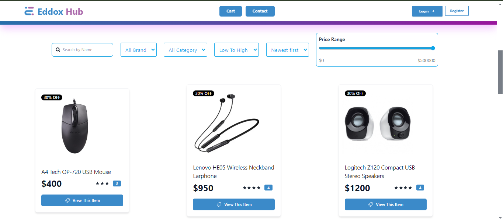

<h1 align="center">Eddox Hub </h1>


<p align="center">
  
</p>
<br>


## Live Link:

[https://eddoxhub.web.app](https://eddoxhub.web.app)

## Overview:
This project involves creating a fully functional single-page website using the MERN stack,
where users can search, filter, categorize, and sort products. The website has pagination for efficient
data loading and include a robust authentication system using Firebase.
The goal is to provide a seamless user experience with a responsive design, ensuring the site works well on all devices.

## Features:
- **MERN Stack Setup:** The project is built using MongoDB, Express.js, React.js, and Node.js.
- **Pagination:** Backend pagination with front-end navigation.
- **Search Functionality:** Search products by name.
- **Product Categorization:** Filter products by brand, category, and price range.
- **Sorting Options:** Sort products by price and date added.
- **Authentication:** Google and email/password authentication using Firebase.


Installed Npm Packages:
```
@tanstack/react-query
axios
Firebase
react
react-hot-toast
react-icons
react-router-dom
react-toastify
sweetalert2
```

### How to Set Up Locally

1. Install npm packages:
    ```sh
    npm i
    ```
2. Create a `.env.local` file containing API keys and Firebase credentials.
3. Run the API server from [Eddox-Server](https://github.com/younusFoysal/Eddox-Hub-Server).
4. Run the development server:
    ```sh
    npm run dev
    ```
5. Browse the application at:
    ```sh
    http://localhost:5173/
    ```

